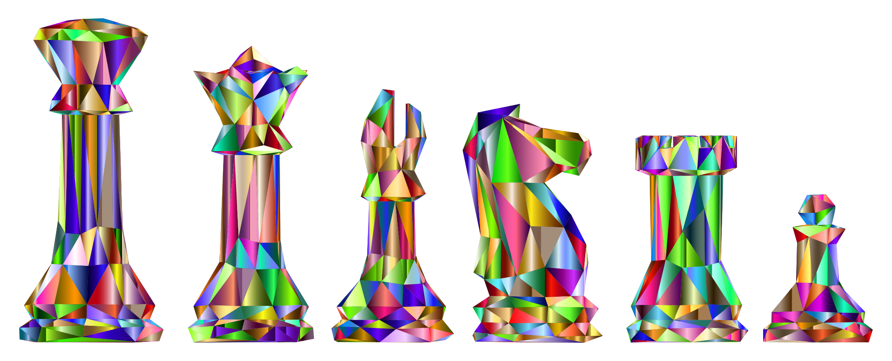

<h1 align="center"> Hi, Welcome </h1>

My name is Derbi Calderon.
 

 
 
 
 
 
Computer Scientist | Software Engineer | Student

---------------------------------------------------------------------------------------------------------------------------------------------------------------------------------

## About Me :smiley:
See my SoloLearn Certificates [Here](https://github.com/derbi-calderon/Sololearn-Certificates).

Currently in 4th year; pursuing Bachelors of Science in Computer Science at [UNLV](https://www.unlv.edu/degree/bs-computer-science). My objective is to use my computer science skills and past work experience to improve end users' experience. 

- :cyclone: Creative and Technical Writer, Open-source enthusiast and Web Developer 🤠.
- :star: 1.5 year intern experience at [MSTS](https://www.nnss.gov/). Worked with VS, XAML, C#, Software architecture, front-end and back end.
- :star: 3 years as teaching assistant/tutor in mathematics, assembly language, algorithms, app dev, c++. 
- 💬 Ask me about creative writing, appealing stories or front end development .
- :books: C, C++, C#, Python, JavaScript, React, HTML/CS. 
- ⚡ **Inspiration**: *"Out in the open wisdom calls aloud, she raises her voice in the public square." prov. 1:20"* 😊.

---------------------------------------------------------------------------------------------------------------------------------------------------------------------------------

##  Connect with Me 😇

   

:heart: Take a look at my repositories and let's get in touch! :heart:
